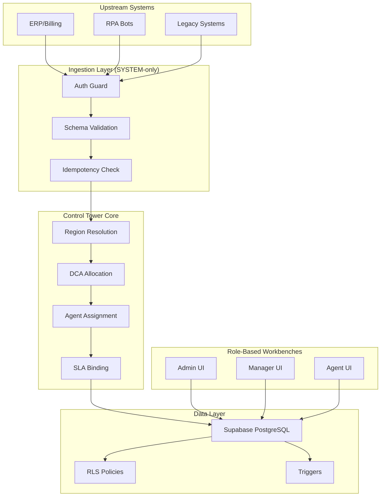
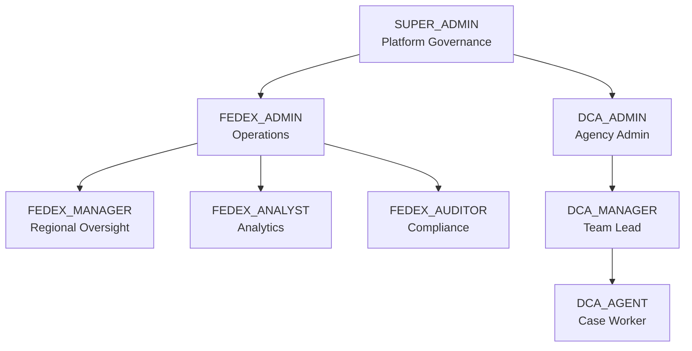
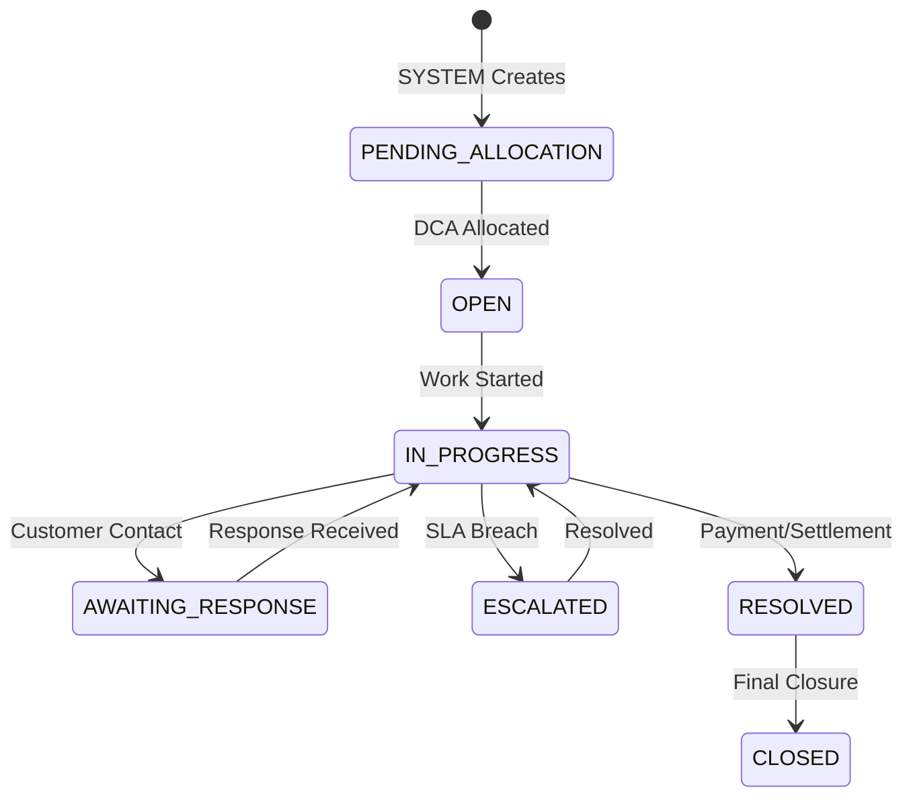
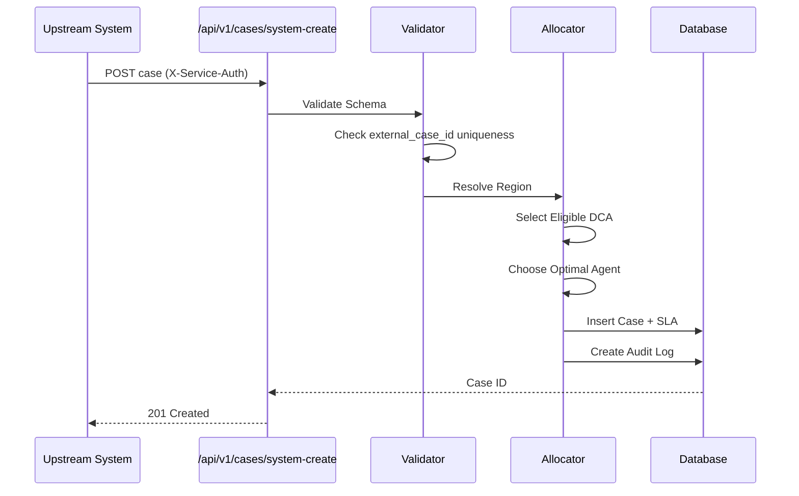

# FedEx DCA Control Tower 🏢📊

**Enterprise Debt Collection Agency Management Platform**

A governance-first, audit-compliant system for managing debt collection operations across multiple agencies, regions, and organizational boundaries. Built with **Next.js 14**, **Supabase PostgreSQL**, and **enterprise RBAC** for FedEx-scale operations.

---

## 🚀 Latest Updates & Governance Hardening

### **⚡ Security & Governance Enhancements**
- **Database Immutability Triggers**: 4 triggers protecting `region_id`, `external_case_id`, `source_system`, `actor_type`
- **SYSTEM-Only Ingestion**: Upstream cases can only be created via authenticated system tokens
- **100+ Governance Tests**: RBAC, auth, ingestion, and security test coverage
- **Audit Trail**: Complete actor identity tracking for compliance

### **🎨 Platform Improvements**
- **Role-Based Workbenches**: Isolated UIs for Admin, Manager, Agent personas
- **MFA for Admins**: Multi-factor authentication enforced for privileged roles
- **Real-time SLA Monitoring**: Automated breach detection and escalation
- **CI/CD Pipeline**: Automated testing with coverage reporting

---

## ✨ Implementation Status

| Feature | Status | Description |
|---------|--------|-------------|
| 🔐 RBAC (10 Roles) | ✅ Complete | Backend-enforced role hierarchy |
| 🌍 Multi-Region | ✅ Complete | Region × Role × Org isolation |
| 📥 SYSTEM Ingestion | ✅ Complete | Automated case intake from upstream |
| 🤖 AI Risk Scoring | ✅ Complete | Advisory ML predictions |
| ⏱️ SLA Automation | ✅ Complete | Auto-bind and breach monitoring |
| 📝 Audit Logging | ✅ Complete | Immutable compliance trail |
| 🧪 Governance Tests | ✅ Complete | 100+ security-focused tests |
| 📊 Analytics | ✅ Complete | Performance dashboards |

---

## 🏗️ Architecture

### System Architecture Diagram



### Technology Stack

**Frontend (Next.js 14 + TypeScript)**
- **Framework**: Next.js 14 with App Router
- **Styling**: Tailwind CSS + Shadcn/ui components
- **Authentication**: Supabase Auth with MFA
- **State Management**: React Query + Zustand
- **Real-time**: Supabase subscriptions

**Backend (API Routes + TypeScript)**
- **Runtime**: Node.js 20 with TypeScript
- **Framework**: Next.js API routes
- **Authorization**: Custom RBAC with 40+ permissions
- **Database**: Supabase PostgreSQL with RLS
- **AI Integration**: External ML service for risk scoring

### Optimized Database Schema

```sql
-- Core Tables with Governance Triggers
cases: id, region_id (IMMUTABLE), external_case_id (IMMUTABLE, UNIQUE),
       source_system (IMMUTABLE), actor_type (IMMUTABLE), assigned_dca_id

dcas: id, region_id, name, capacity, is_active, performance_score

users: id, email, role, dca_id, region_id, state_code

audit_logs: id, actor_type, actor_id, action, resource_id, created_at (IMMUTABLE)

-- Performance Indexes
idx_cases_region_status ON cases(region_id, status)
idx_cases_external_id ON cases(external_case_id) -- UNIQUE
idx_audit_actor_type ON audit_logs(actor_type)
```

---

## 🔒 Role & Governance Model

### Role Hierarchy



### Permission Matrix

| Action | SUPER_ADMIN | FEDEX_ADMIN | DCA_ADMIN | DCA_AGENT |
|--------|:-----------:|:-----------:|:---------:|:---------:|
| Create DCAs | ✅ | ❌ | ❌ | ❌ |
| View All Cases | ✅ | ✅ | Own DCA | Assigned |
| Assign Cases | ❌ (SYSTEM) | ❌ (SYSTEM) | ❌ | ❌ |
| Create Cases | ❌ (SYSTEM) | ❌ (SYSTEM) | ❌ | ❌ |
| Update Cases | ❌ | ✅ | ✅ | ✅ |
| View Audit Logs | ✅ | ✅ | ❌ | ❌ |
| Manage Users | ✅ | ✅ | Own DCA | ❌ |

> **Note**: Case creation is SYSTEM-only. No human role can create cases directly.

---

## 🔄 Case Lifecycle Flow

### Case State Machine



### Allocation Flow



---

## ✨ Features Implemented

### 🎨 User Interface & Design
- **Role-Based Workbenches**: Admin, Manager, Agent isolated UIs
- **Responsive Design**: Mobile-first with desktop optimization
- **Real-time Updates**: Live case status and notifications
- **Interactive Dashboards**: Performance metrics and SLA tracking

### 🤖 Automation & AI
- **Risk Scoring**: ML-powered collection difficulty prediction
- **Priority Recommendation**: AI-suggested case prioritization
- **Auto-Allocation**: Algorithmic DCA and agent assignment
- **SLA Automation**: Automatic binding and breach detection

### 🗄️ Data & Security
- **Row-Level Security**: PostgreSQL RLS for data isolation
- **Immutability Triggers**: 4 governance field protections
- **Audit Trail**: Complete actor identity logging
- **Connection Pooling**: Optimized database performance

### 🔐 Authentication & Authorization
- **10-Role RBAC**: Granular permission system
- **MFA for Admins**: Enforced multi-factor for privileged roles
- **Region Isolation**: Data scoped by geography
- **SYSTEM vs HUMAN**: Distinct auth for automation vs users

> **Security**: Backend authorization is source of truth. UI visibility ≠ access control.

---

## 📁 Project Structure

```
fedex-dca-control-tower/
├── apps/
│   ├── web/                    # Next.js 14 Application
│   │   ├── app/                # Pages & API Routes
│   │   │   ├── (dashboard)/    # Protected routes
│   │   │   │   ├── admin/      # Admin workbench
│   │   │   │   ├── manager/    # Manager workbench
│   │   │   │   └── agent/      # Agent workbench
│   │   │   └── api/            # API endpoints
│   │   │       ├── v1/         # SYSTEM APIs
│   │   │       └── ...         # Human APIs
│   │   ├── components/         # React components
│   │   ├── lib/                # Backend domain logic
│   │   │   ├── auth/           # RBAC & permissions
│   │   │   ├── case/           # Case lifecycle
│   │   │   ├── allocation/     # DCA/agent assignment
│   │   │   ├── sla/            # SLA management
│   │   │   └── audit/          # Audit logging
│   │   └── __tests__/          # Governance tests
│   └── ml-service/             # Python AI/ML Service
├── supabase/
│   └── migrations/             # 42 database migrations
├── docs/                       # Architecture documentation
└── scripts/                    # Utility scripts
```

---

## 🧪 Test Users & Demo Access

> **Password for ALL test users:** `Password123!`

### ✅ Completed UI Workbenches

| Role | Email | Status | Description |
|------|-------|--------|-------------|
| **DCA_AGENT** | `agent1@tatarecovery.in` | ✅ V1 Complete | Agent case workbench with case management, activities, and performance tracking |
| **DCA_MANAGER** | `manager@tatarecovery.in` | ✅ V1 Complete | Manager dashboard with team oversight, agent management, and case allocation |

### 🚧 UI In Development

| Role | Email | Status | Description |
|------|-------|--------|-------------|
| SUPER_ADMIN | `system.admin@fedex.com` | 🚧 In Progress | Full platform governance access |
| FEDEX_ADMIN | `india.admin@fedex.com` | 🚧 In Progress | Regional admin controls |
| FEDEX_MANAGER | `mumbai.manager@fedex.com` | 🚧 In Progress | Regional operations management |
| DCA_ADMIN | `rajesh.sharma@tatarecovery.in` | 🚧 In Progress | DCA-level administration |

### 🔑 Quick Login (Recommended Test Accounts)

```bash
# DCA Agent Workbench (V1 Complete ✅)
Email: agent1@tatarecovery.in
Password: Password123!

# DCA Manager Dashboard (V1 Complete ✅)
Email: manager@tatarecovery.in
Password: Password123!
```

### 📋 All Available Test Users

**FedEx Users:**
| Email | Role | Region |
|-------|------|--------|
| `system.admin@fedex.com` | SUPER_ADMIN | Global |
| `india.admin@fedex.com` | FEDEX_ADMIN | INDIA |
| `mumbai.manager@fedex.com` | FEDEX_MANAGER | INDIA |

**Tata Recovery Services (DCA):**
| Email | Role | State |
|-------|------|-------|
| `rajesh.sharma@tatarecovery.in` | DCA_ADMIN | All |
| `manager@tatarecovery.in` | DCA_MANAGER | MH |
| `agent1@tatarecovery.in` | DCA_AGENT | MH |
| `agent2@tatarecovery.in` | DCA_AGENT | MH |

**InfoSol Collections (DCA):**
| Email | Role | State |
|-------|------|-------|
| `admin@infosolcollections.in` | DCA_ADMIN | All |
| `manager@infosolcollections.in` | DCA_MANAGER | DL |
| `agent1@infosolcollections.in` | DCA_AGENT | DL |
| `agent2@infosolcollections.in` | DCA_AGENT | DL |

---

## 🚀 Getting Started

### Prerequisites
- Node.js 20+
- pnpm 8+
- Supabase account
- PostgreSQL (via Supabase)

### Installation

```bash
# Clone repository
git clone https://github.com/K007-K/fedex-dca-control-tower.git
cd fedex-dca-control-tower

# Install dependencies
cd apps/web
npm install

# Setup environment
cp .env.example .env.local
# Edit .env.local with your credentials

# Run development server
npm run dev
```

### Environment Variables

```bash
# Required
NEXT_PUBLIC_SUPABASE_URL=https://xxx.supabase.co
NEXT_PUBLIC_SUPABASE_ANON_KEY=eyJ...
SUPABASE_SERVICE_ROLE_KEY=eyJ...   # Backend only!
SERVICE_SECRET=<min 32 chars>       # SYSTEM auth

# Optional
ML_SERVICE_URL=http://localhost:8000
SENDGRID_API_KEY=...
```

---

## 🗺️ API Endpoints

### **SYSTEM APIs (X-Service-Auth)**

| Endpoint | Method | Description |
|----------|--------|-------------|
| `/api/v1/cases/system-create` | POST | Create case from upstream |
| `/api/v1/cases/bulk-create` | POST | Batch case creation |
| `/api/v1/health` | GET | System health check |

### **Human APIs (Session Auth)**

| Endpoint | Method | Description |
|----------|--------|-------------|
| `/api/cases` | GET | List cases (role-filtered) |
| `/api/cases/[id]` | GET/PATCH | Case detail/update |
| `/api/agent/dashboard` | GET | Agent metrics |
| `/api/manager/team` | GET | Team overview |
| `/api/admin/dashboard` | GET | Admin analytics |

### **Error Contract**

```json
{
    "error": {
        "code": "FORBIDDEN",
        "message": "Missing permission: cases:create"
    }
}
```

---

## 🧪 Testing Strategy

### Test Coverage

| Category | Files | Tests |
|----------|-------|-------|
| RBAC | `rbac.test.ts` | 25+ |
| System Auth | `system-auth.test.ts` | 10+ |
| Region Isolation | `region-isolation.test.ts` | 15+ |
| Ingestion | `ingestion-validation.test.ts` | 20+ |
| Security | `negative-tests.test.ts` | 20+ |
| Governance | `invariants.test.ts` | 15+ |

### Run Tests

```bash
npm test                    # Run all tests
npm test -- --coverage      # With coverage report
npm test -- --watch         # Watch mode
```

---

## 🛣️ Roadmap

### 🎨 Monitoring & Operations
- [ ] Sentry error integration
- [ ] PagerDuty alerting
- [ ] Performance metrics dashboard

### 🚀 Scale & Performance
- [ ] Bulk ingestion optimization
- [ ] Read replica support
- [ ] Advanced caching layer

### 🤖 AI Enhancements
- [ ] Collection strategy recommendations
- [ ] Customer contact optimization
- [ ] Predictive escalation

---

## 📄 License

This project is proprietary software developed for FedEx internal use.

---

## 🙏 Acknowledgments

- **Supabase** - Database and authentication
- **Next.js** - React framework
- **Shadcn/ui** - Component library
- **Tailwind CSS** - Styling

---

## ✅ Governance Statement

**This system is governed.** Every access decision is made by the backend. Every mutation is audited. Every role has explicit boundaries.

**This system is auditable.** The audit log is immutable. Actor identity is captured. Actions are traceable to users or services.

**This system is enterprise-ready.** It enforces Region × Role × Organization isolation. It separates SYSTEM from HUMAN actors. It prevents privilege escalation by design.

---

**Maintained by:** Me  
**Last Updated:** 2026-01-11  
**Version:** 1.0.0
