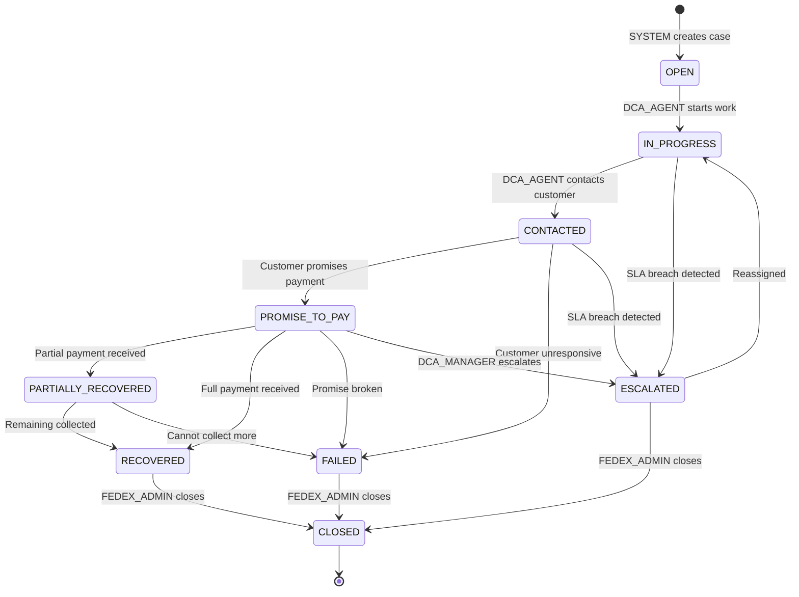
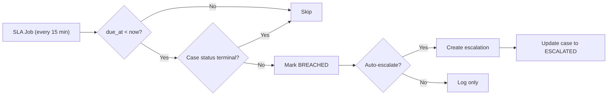

# Case Lifecycle Diagram

## State Definitions

| State | Description | Terminal |
|-------|-------------|----------|
| `OPEN` | Case created, pending assignment | No |
| `IN_PROGRESS` | DCA actively working | No |
| `CONTACTED` | Customer has been contacted | No |
| `PROMISE_TO_PAY` | Customer committed to pay | No |
| `PARTIALLY_RECOVERED` | Some amount collected | No |
| `RECOVERED` | Full amount collected | Yes* |
| `FAILED` | Collection failed | Yes* |
| `ESCALATED` | Requires attention | No |
| `CLOSED` | Final terminal state | Yes |

*Requires FEDEX_ADMIN to transition to CLOSED

## Transition Rules

| From | To | Allowed Roles |
|------|----|---------------|
| OPEN | IN_PROGRESS | DCA_AGENT |
| IN_PROGRESS | CONTACTED | DCA_AGENT |
| CONTACTED | PROMISE_TO_PAY | DCA_AGENT |
| CONTACTED | FAILED | DCA_AGENT |
| ANY | ESCALATED | DCA_MANAGER |
| RECOVERED | CLOSED | FEDEX_ADMIN |
| FAILED | CLOSED | FEDEX_ADMIN |
| ESCALATED | IN_PROGRESS | FEDEX_ADMIN |
| ESCALATED | CLOSED | FEDEX_ADMIN |

## SLA Breach Detection

