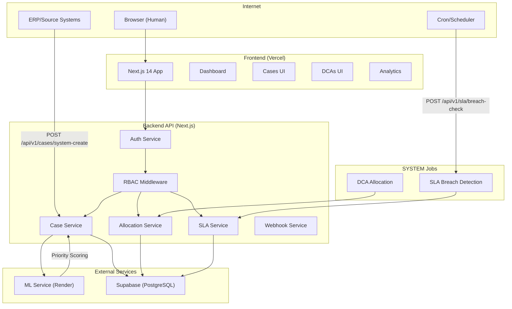

# System Architecture Diagram

## Component Responsibilities

| Component | Technology | Responsibility |
|-----------|------------|----------------|
| Frontend | Next.js 14 (Vercel) | UI, dashboards, forms |
| Backend | Next.js API Routes | Auth, RBAC, business logic |
| ML Service | FastAPI (Render) | Priority scoring, predictions |
| Database | Supabase (PostgreSQL) | Data storage, RLS, triggers |
| SYSTEM Jobs | Cron-triggered APIs | SLA breach check, allocation |

## Data Flow

1. **Human Requests**: Browser → Frontend → Backend → Database
2. **SYSTEM Requests**: ERP → Backend API → Database
3. **ML Inference**: Backend → ML Service → Backend
4. **Scheduled Jobs**: Cron → Backend API → Database
